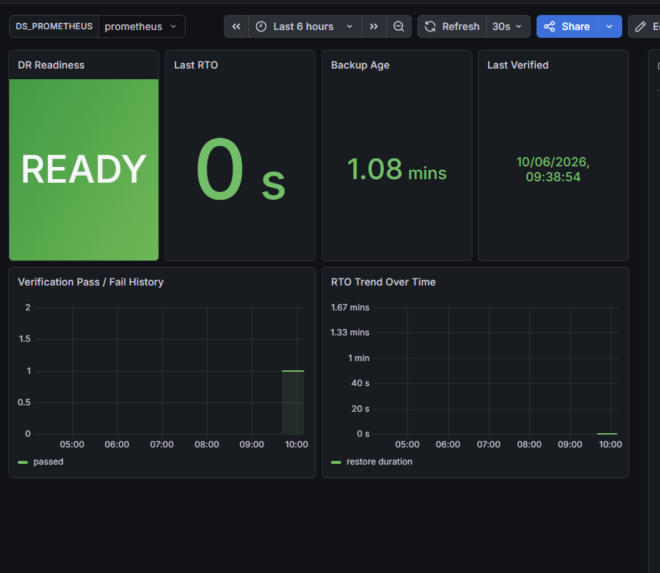
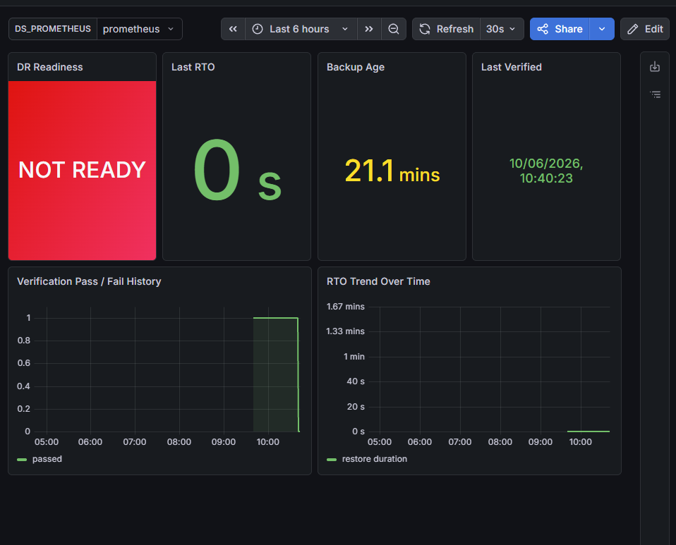
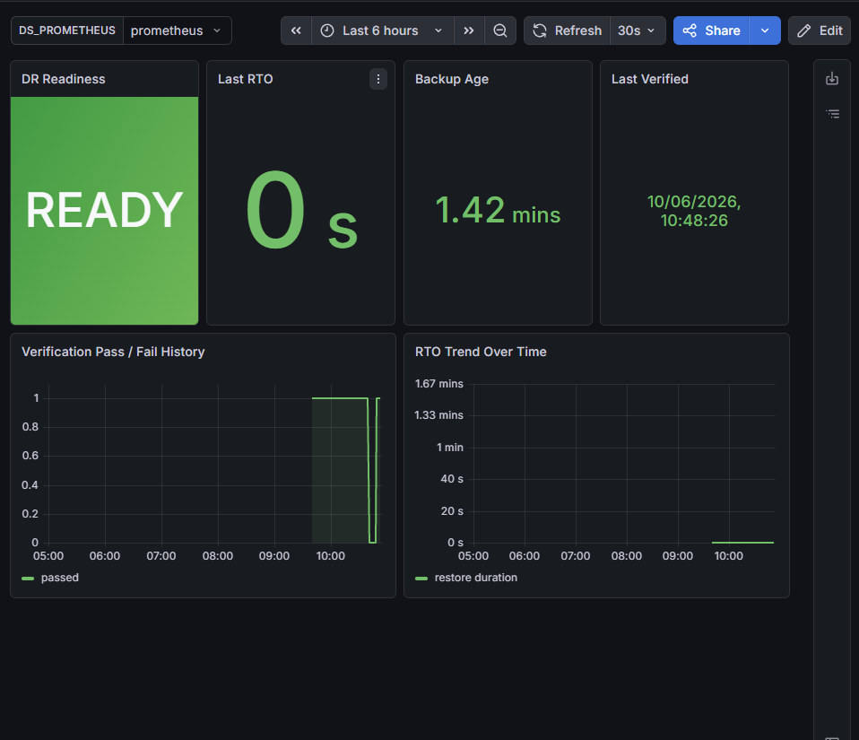
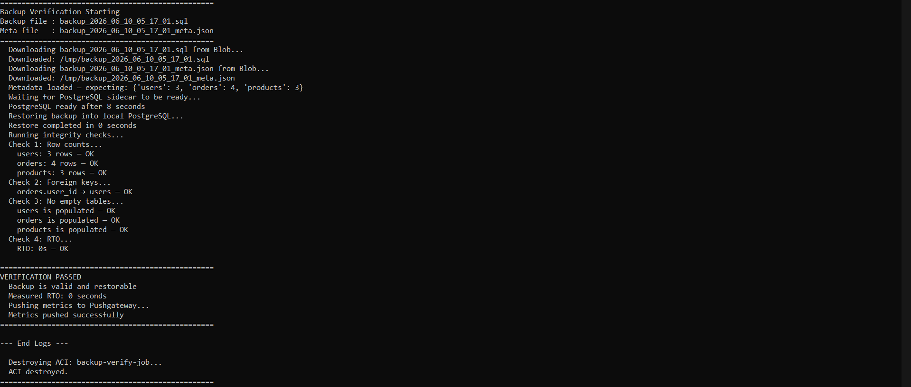
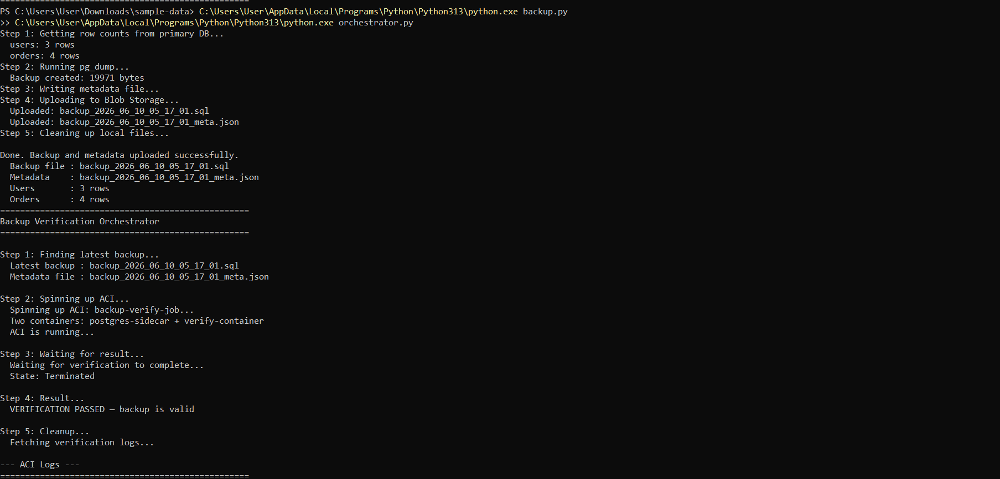

# Backup Verification Pipeline

> Most disaster recovery systems assume their backups are valid — but never verify them.
> This project automatically restores every backup into a throwaway environment, checks the data is internally consistent, measures the real restore time, and publishes the result to a live dashboard so engineers always know whether they can actually recover **before disaster strikes**.



---

## The Problem

When a disaster happens — a corrupted database, an accidental delete, a failed deployment — the team triggers their recovery process and discovers the backup is empty, corrupt, or incomplete. By then it is too late.

**A backup that has never been tested is not a backup. It is a hope.**

---

## Architecture

```
┌─────────────────────────────────────────────────────────────────┐
│                                                                   │
│   Azure PostgreSQL  ──pg_dump──►  Blob Storage                   │
│        (primary)                  (.sql + meta.json)             │
│                                         │                        │
│                                    orchestrator.py               │
│                                         │                        │
│                          ┌──────────────▼──────────────┐        │
│                          │   Azure Container Instances  │        │
│                          │                              │        │
│                          │  ┌─────────────┐  ┌───────┐ │        │
│                          │  │ postgres:16 │  │verify │ │        │
│                          │  │  (sidecar)  │◄─│  .py  │ │        │
│                          │  └─────────────┘  └───┬───┘ │        │
│                          │    fresh every run     │     │        │
│                          │    destroyed after  ◄──┘     │        │
│                          └─────────────────────────────┘        │
│                                         │                        │
│                                    Pushgateway                   │
│                                         │                        │
│                          Prometheus ◄───┘                        │
│                               │                                  │
│                           Grafana                                │
│                      DR Readiness Dashboard                      │
│                                                                   │
└─────────────────────────────────────────────────────────────────┘
```

---

## Live Demo

### System healthy — backup verified and valid


### Corruption detected — backup failed integrity checks


### System recovered — fresh backup verified clean


### Verification pipeline — all four integrity checks passing


### Orchestrator — full pipeline run end to end


---

## How It Works

After every `pg_dump` backup is created and uploaded to Azure Blob Storage, an automated pipeline:

| Step | What happens |
|------|-------------|
| 1 | `pg_dump` captures the database. Row counts stored as a metadata receipt alongside the backup in Blob Storage. |
| 2 | Orchestrator spins up ACI with two containers — a fresh empty PostgreSQL sidecar and the verify container. |
| 3 | `verify.py` downloads the backup from Blob and restores it into the sidecar. Restore time is measured. |
| 4 | Three integrity checks run — row counts vs metadata, foreign keys via system catalog, no empty tables. |
| 5 | Results pushed to Prometheus via Pushgateway before container exits. |
| 6 | ACI destroyed unconditionally in a `finally` block — pass, fail, or crash. |

If verification fails the dashboard turns red immediately. Engineers know the backup is untrustworthy before a disaster forces them to find out.

---

## Dashboard

The Grafana dashboard answers one question: **if the primary database died right now, could we recover?**

| Panel | What it shows |
|-------|--------------|
| DR Readiness | GREEN (READY) or RED (NOT READY) |
| Last RTO | Actual measured restore time in seconds |
| Backup Age | How old the most recent verified backup is |
| Last Verified | Exact timestamp of last verification run |
| Pass/Fail History | Time series — trend over past 6 hours |
| RTO Trend | Catches restore time degradation over time |

---

## Key Design Decisions

**Why a throwaway environment and not the standby database?**
Restoring into an existing database causes conflicts with existing data and masks problems. A completely fresh environment means any result is unambiguous — if it works, the backup is valid. If it fails, the backup is broken. No other variables.

**Why Pushgateway instead of direct Prometheus scraping?**
The verification container runs for approximately two minutes then gets destroyed. Prometheus scrapes on a 15-second interval — by the time the third scrape fires the container is already gone. Pushgateway holds the last known result so Prometheus can scrape it continuously even after the job finishes.

**Why dynamic integrity checks instead of hardcoded queries?**
Hardcoded row count thresholds break as the database grows. This pipeline captures the exact row counts at backup time and stores them in a metadata receipt alongside the backup file. Verification always checks against the ground truth from that specific backup — not a static number.

**Why is cleanup in a `finally` block?**
The throwaway container must be destroyed regardless of whether verification passes, fails, or crashes. Python's `finally` block runs unconditionally. This prevents ghost containers running indefinitely and generating unexpected Azure costs.

---

## Tech Stack

| Tool | Purpose |
|------|---------|
| Azure PostgreSQL Flexible Server | Primary database |
| pg_dump | Logical backup — schema + data |
| Azure Blob Storage | Backup and metadata storage |
| Azure Container Instances | Throwaway verification environment |
| Azure Container Registry | Docker image hosting |
| Python | Backup, orchestration, verification logic |
| Prometheus + Pushgateway | Metrics collection for short-lived jobs |
| Grafana | DR readiness dashboard |

---

## What This Project Is Not

This is a **disaster recovery** system, not a **high availability** system. It accepts that failures happen and provides a verified, tested recovery path. It does not prevent downtime — it ensures that when downtime happens, the recovery actually works.

| | This project | High availability |
|--|-------------|-------------------|
| RTO | Under 10 minutes | Under 30 seconds |
| RPO | Under 15 minutes | Zero — synchronous replication |
| Standby | Cold — restored on demand | Hot — always running |
| Right for | SaaS, internal tools, gov portals | Banks, payment processors, exchanges |

---

## Project Structure

```
backup-verify-pipeline/
├── backup.py                     # pg_dump + metadata → Blob Storage
├── verify.py                     # runs inside ACI — restore + checks
├── orchestrator.py               # spins up ACI, waits, destroys
├── Dockerfile                    # verify.py container image
├── docker-compose.yml            # local Prometheus + Pushgateway + Grafana
├── prometheus.yml                # Prometheus scrape config
├── dr_readiness_dashboard.json   # Grafana dashboard — import directly
├── .env.example                  # required environment variables
└── docs/                         # screenshots
    ├── dashboard-ready.png
    ├── dashboard-failed.png
    ├── dashboard-recovered.png
    ├── pipeline-logs.png
    └── orchestrator-output.png
```

---

## Setup

**Prerequisites:** Azure CLI, Docker, Python 3.13+, PostgreSQL client tools

**1. Clone the repo**
```bash
git clone https://github.com/AshenEllawala/backup-verify-pipeline.git
cd backup-verify-pipeline
```

**2. Set environment variables**
```bash
cp .env.example .env
# fill in your values
```

**3. Start local monitoring stack**
```bash
docker compose up -d
```

**4. Run a backup**
```bash
python backup.py
```

**5. Run verification**
```bash
python orchestrator.py
```

**6. Open Grafana**
```
http://localhost:3000
```
Import `dr_readiness_dashboard.json` and select your Prometheus data source.

---

## Author

**Ashen Ellawala**
BICT undergraduate — Network Technology, University of Kelaniya · AZ-900 Certified

[](https://github.com/AshenEllawala)
[](https://linkedin.com/in/ashen-ellawala)
